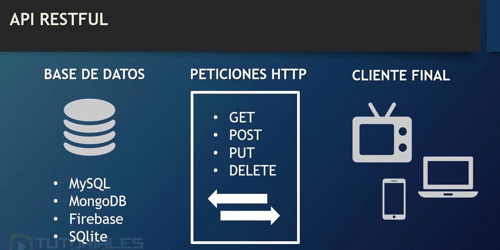

## Que es una API (Application Program Interface)
Interfaz de programación para las aplicaciones

## Que es RESTFUL (Representational State Transfer)
Trasferencia de estado representacional

## API REST
Interfaz de Aplicaciones para Transferir Datos

## Características
- Desarrolladas por programadores para programadores
- Publicas 
- Privadas
- Gratuitas
- Pagas
- Es indispensable crear documentación para su uso

## Ver Documentación para la API que vamos a usar
Descargar el código de la API.

